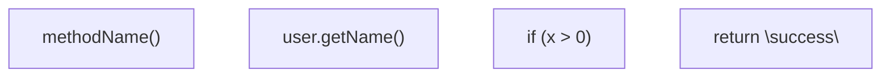
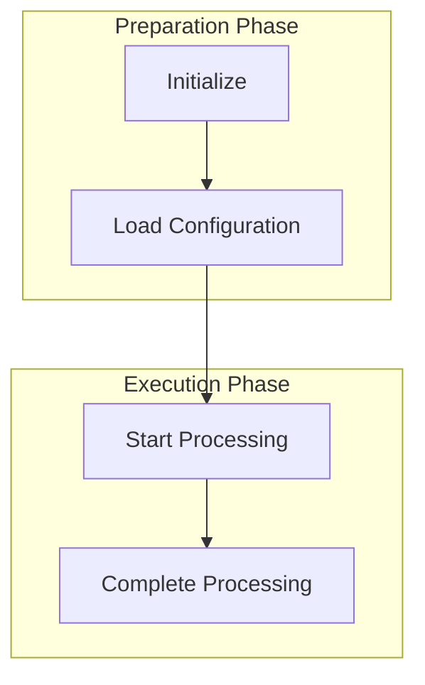
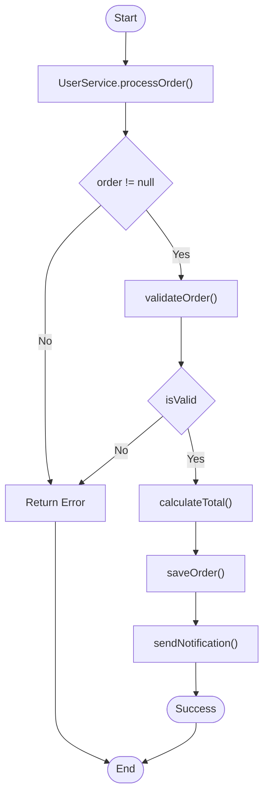

# Mermaid Flowchart Syntax Specification

## Basic Syntax

### Node Definition

#### Rectangle Node (Standard Node)
```
A["Text Content"]
```

#### Diamond Node (Decision Node)
```
B{"Decision Condition"}
```

#### Rounded Rectangle (Start/End Node)
```
C(["Start/End"])
```

#### Circle Node
```
D(("Circle"))
```

#### Hexagon Node
```
E{{Hexagon}}
```

### Connection Definition

#### Solid Arrow (Standard Flow)
```
A --> B
```

#### Solid Line Without Arrow
```
A --- B
```

#### Dashed Arrow
```
A -.-> B
```

#### Dashed Line Without Arrow
```
A -.- B
```

#### Connection with Text Annotation
```
A -- "Yes" --> B
A -- "No" --> C
```

### Node ID Rules

- **Must Use**: English letters or numbers (A-Z, a-z, 0-9)
- **Recommended Formats**:
  - Single letter: A, B, C
  - Letter + number: A1, B2, Node3
  - CamelCase: StartNode, DecisionPoint

- **Prohibited**:
  - Spaces, special characters (@#$%, etc.)
  - Chinese characters
  - Reserved keywords

### Special Character Handling

When node text contains special characters, must use double quotes to wrap:



### Subgraph

Used to group related nodes:



## Java Code Mapping Rules

### Method Calls
```
ClassName.methodName()
```

### Conditional Judgments
```
if (condition)
```

### Loop Structures
```
for (...)
while (...)
```

### Return Statements
```
return value
```

### Exception Handling
```
try/catch
throw Exception
```

## Complete Example



## Common Errors

### Error 1: Node ID Contains Spaces
```
❌ A node --> B
✅ A_node --> B
```

### Error 2: Special Characters Not Wrapped
```
❌ A[methodName()] --> B
✅ A["methodName()"] --> B
```

### Error 3: Connection Syntax Error
```
❌ A -> B
✅ A --> B
```

### Error 4: Duplicate Node ID
```
❌ A["Node1"] --> A["Node2"]
✅ A["Node1"] --> B["Node2"]
```

## Best Practices

1. **Keep It Simple**: Node text should not be too long
2. **Consistent Style**: Use the same wrapping method for all nodes
3. **Reasonable Grouping**: Use subgraphs to organize complex flows
4. **Add Comments**: Use `%%` to add comment explanations
5. **Vertical Layout**: Prefer using `flowchart TD` (Top-Down)
